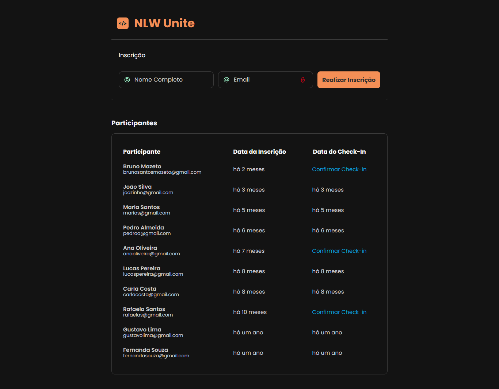

<h1 align="center">Projeto Full-stack com HTML, CSS e JavaScript</h1>

Projeto full-stack desenvolvido durante o evento da NLW Unite, com o objetivo de criar uma aplicação para cadastro e check-in de usuários em um evento

## Tecnologias Utilizadas

Esse projeto foi desenvolvido com as seguintes tecnologias:

- HTML
- CSS
- JavaScript
- DayJS (para formatar o tipo de data)

